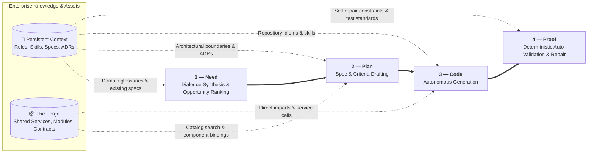

# Context Layer

The Context Layer is the organization's knowledge in a form a model can consume. It is the single
highest-leverage investment in Agentic Software Factory, and the one most organizations skip in favour of better
prompts.

## Why it exists

A model has no memory of your codebase, your conventions, or your decisions. Every session starts
from zero. Without a context layer, each engineer re-explains the same things, differently, forever.

In an operating model where **developers do not code** and **AI writes 100% of the implementation**,
the Context Layer is the primary programming language of the organization.

> Context beats prompting. A well-fed model with committed repository context outperforms a
> well-prompted model with no context.

## Primitives

| Primitive | Loaded | Use for |
|---|---|---|
| **Instruction** | Automatically, when matching files are in context | Stable standards: conventions, structure, security rules, deterministic requirements |
| **Skill** | On demand, by name or description | Multi-step workflows with a contract and reusable references (e.g. running mutation tests, generating API schemas) |
| **Agent** | Explicitly selected | A bounded specialist configuration with dedicated tools (e.g. Coding Agent, Self-Healing Agent, Spec Agent) |
| **Spec** | Referenced | Ground truth of what the system actually does, kept current with every release |
| **ADR** | Referenced | Architectural choices, invariants, and rejected alternatives |
| **Context Bundle** | Assembled per work item | The compiled context package (Plan record, referenced specs, ADRs, active skills, and instructions) fed to the AI agent |
| **Deterministic Harness** | Executed in CI/local | The suite of linters, strict type checks, contract tests, and mutation suites that auto-validate AI output |

### Choosing between them

```
Is it a standing rule tied to file types?        → instruction
Is it a repeatable multi-step procedure?         → skill
Is it a distinct specialty with its own scope?   → agent
Is it a description of existing behaviour?       → spec
Is it the reasoning behind a choice?             → ADR
```

## Two Enterprise Pillars: Persistent Context & The Forge

Both **[2 — Plan](./layer-plan)** and **[3 — Code](./layer-code)** operate continuously on top of two complementary enterprise pillars:



| Dimension | Persistent Context | The Forge |
|---|---|---|
| **What it represents** | *Domain ground truth, rules & standards* (specs, ADRs, skills, instructions) | *What we reuse* (microservices, hardened code modules, SDKs, certified API contracts) |
| **Role in 1 — Need** | Grounds client dialogue extraction against existing system specs and domain glossaries | Identifies existing platform capabilities related to client requests |
| **Role in 2 — Plan** | Informs constraints, non-functional invariants, and domain boundaries | Identifies candidate shared services and API schemas to bind into the plan |
| **Role in 3 — Code** | Guides AI agents with repository conventions, type rules, and execution skills | Supplies concrete packages, SDKs, and endpoints for agents to import and invoke |
| **Role in 4 — Proof** | Constrains AI self-repair loops so automated patches comply with ADRs & contracts | Provides mocked service doubles and contract schemas for testbed verification |
| **Storage & Scope** | Versioned inside the repository (`.github/`, `skills/`, `docs/`) and provisioned via persistent context & agent catalogs (e.g. `coding-pal`) | Versioned in enterprise package registries, service catalogs, and in-context templates (e.g. `Gatelin`, `foxnox`) |

## Where it lives

In the repository, next to the code it describes, reviewed like the code it describes.

```
<repo>/
  instructions/*.instructions.md
  skills/<name>/SKILL.md
  skills/<name>/references/*.md
  agents/*.agent.md
  docs/specs/*.md
  docs/adr/*.md
```

## Rules

1. **Committed, reviewed, versioned.** A context artifact changes through a pull request.
2. **Evidence-driven.** New artifacts come from [6 — Learn](./layer-learn): something was corrected
   twice, or re-explained twice.
3. **Small and specific.** Instructions that try to cover everything get ignored by models and
   humans alike.
4. **Scoped precisely.** Instructions declare the narrowest matching pattern that works; broad
   patterns waste context on every request.
5. **Deleted when wrong.** An outdated instruction is worse than none: it produces confident,
   consistent, wrong output.
6. **Never contains secrets.** Context artifacts are read by tools and shared across sessions.

## Maintenance loop

```mermaid
---
caption: How the context layer is maintained
---

flowchart LR
  work[Work in Stages 2 & 3 (Plan / Code)] --> corr[Repeated correction observed]
  corr --> decide{Which primitive?}
  decide -->|standing rule| inst[Instruction]
  decide -->|procedure| skill[Skill]
  decide -->|specialty| agent[Agent]
  decide -->|invariant / boundary| test[Deterministic Control]
  inst --> eval[Evaluation]
  skill --> eval
  agent --> eval
  test --> eval
  eval -->|passes bar| merge[Merged]
  eval -->|fails| back[Revised or dropped]
  merge --> work
```

No context change is adopted without passing automated evaluation. The layer is code, and
untested code is not merged.

## Health signals

| Signal | Healthy | Unhealthy |
|---|---|---|
| Self-healing iterations needed | Trending down (1–2 loops) | Flat or hitting limit (> 4 loops) |
| Manual human corrections during validation | Near zero | Frequent |
| Instruction count | Stable, each one used | Growing without pruning |
| Deterministic test pass on first agent pass | > 80% | < 50% |
| Generated output matching codebase conventions | High | Requires rewriting |
