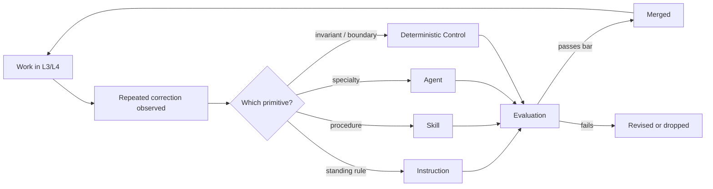

# Context Layer

The Context Layer is the organization's knowledge in a form a model can consume. It is the single
highest-leverage investment in Agentic Software Factory, and the one most organizations skip in favour of better
prompts.

## Why it exists

A model has no memory of your codebase, your conventions, or your decisions. Every session starts
from zero. Without a context layer, each engineer re-explains the same things, differently, forever.

In an operating model where **developers do not code** and **AI writes 100% of the implementation**,
the Context Layer is the primary programming language of the organization.

> Context beats prompting. A well-fed model with committed repository context outperforms a
> well-prompted model with no context.

## Primitives

| Primitive | Loaded | Use for |
|---|---|---|
| **Instruction** | Automatically, when matching files are in context | Stable standards: conventions, structure, security rules, deterministic requirements |
| **Skill** | On demand, by name or description | Multi-step workflows with a contract and reusable references (e.g. running mutation tests, generating API schemas) |
| **Agent** | Explicitly selected | A bounded specialist configuration with dedicated tools (e.g. Build Agent, Self-Healing Agent, Spec Agent) |
| **Spec** | Referenced | Ground truth of what the system actually does, kept current with every release |
| **ADR** | Referenced | Architectural choices, invariants, and rejected alternatives |
| **Forge** | Assembled per work item | The bundle of client meeting transcripts, Intent records, specs, ADRs, and instructions fed to the AI build agent |
| **Deterministic Harness** | Executed in CI/local | The suite of linters, strict type checks, contract tests, and mutation suites that auto-validate AI output |

### Choosing between them

```
Is it a standing rule tied to file types?        → instruction
Is it a repeatable multi-step procedure?         → skill
Is it a distinct specialty with its own scope?   → agent
Is it a description of existing behaviour?       → spec
Is it the reasoning behind a choice?             → ADR
```

## Where it lives

In the repository, next to the code it describes, reviewed like the code it describes.

```
<repo>/
  instructions/*.instructions.md
  skills/<name>/SKILL.md
  skills/<name>/references/*.md
  agents/*.agent.md
  docs/specs/*.md
  docs/adr/*.md
```

## Rules

1. **Committed, reviewed, versioned.** A context artifact changes through a pull request.
2. **Evidence-driven.** New artifacts come from [Learn](./layer-learn): something was corrected
   twice, or re-explained twice.
3. **Small and specific.** Instructions that try to cover everything get ignored by models and
   humans alike.
4. **Scoped precisely.** Instructions declare the narrowest matching pattern that works; broad
   patterns waste context on every request.
5. **Deleted when wrong.** An outdated instruction is worse than none: it produces confident,
   consistent, wrong output.
6. **Never contains secrets.** Context artifacts are read by tools and shared across sessions.

## Maintenance loop



No context change is adopted without passing [Evaluation](./evaluation). The layer is code, and
untested code is not merged.

## Health signals

| Signal | Healthy | Unhealthy |
|---|---|---|
| Self-healing iterations needed | Trending down (1–2 loops) | Flat or hitting limit (> 4 loops) |
| Manual human corrections during validation | Near zero | Frequent |
| Instruction count | Stable, each one used | Growing without pruning |
| Deterministic test pass on first agent pass | > 80% | < 50% |
| Generated output matching codebase conventions | High | Requires rewriting |
