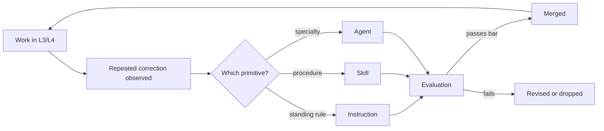

# Context Layer

The Context Layer is the organization's knowledge in a form a model can consume. It is the single
highest-leverage investment in Flow Stack, and the one most organizations skip in favour of better
prompts.

## Why it exists

A model has no memory of your codebase, your conventions, or your decisions. Every session starts
from zero. Without a context layer, each engineer re-explains the same things, differently, forever.

> Context beats prompting. A well-fed model with an average prompt outperforms a well-prompted model
> with no context.

## Primitives

| Primitive | Loaded | Use for |
|---|---|---|
| **Instruction** | Automatically, when matching files are in context | Stable standards: conventions, structure, security rules |
| **Skill** | On demand, by name or description | Multi-step workflows with a contract and reusable references |
| **Agent** | Explicitly selected | A bounded specialty with its own tools and scope |
| **Spec** | Referenced | What a system actually does, generated from code and kept current |
| **ADR** | Referenced | Why a decision was taken, and what was rejected |

### Choosing between them

```
Is it a standing rule tied to file types?        → instruction
Is it a repeatable multi-step procedure?         → skill
Is it a distinct specialty with its own scope?   → agent
Is it a description of existing behaviour?       → spec
Is it the reasoning behind a choice?             → ADR
```

## Where it lives

In the repository, next to the code it describes, reviewed like the code it describes.

```
<repo>/
  instructions/*.instructions.md
  skills/<name>/SKILL.md
  skills/<name>/references/*.md
  agents/*.agent.md
  docs/specs/*.md
  docs/adr/*.md
```

## Rules

1. **Committed, reviewed, versioned.** A context artifact changes through a pull request.
2. **Evidence-driven.** New artifacts come from [Learn](./layer-learn): something was corrected
   twice, or re-explained twice.
3. **Small and specific.** Instructions that try to cover everything get ignored by models and
   humans alike.
4. **Scoped precisely.** Instructions declare the narrowest matching pattern that works; broad
   patterns waste context on every request.
5. **Deleted when wrong.** An outdated instruction is worse than none: it produces confident,
   consistent, wrong output.
6. **Never contains secrets.** Context artifacts are read by tools and shared across sessions.

## Maintenance loop



No context change is adopted without passing [Evaluation](./evaluation). The layer is code, and
untested code is not merged.

## Health signals

| Signal | Healthy | Unhealthy |
|---|---|---|
| Repeated manual corrections | Trending down | Flat or rising |
| Instruction count | Stable, each one used | Growing without pruning |
| Time for a newcomer's first merged change | Days | Weeks |
| Generated output matching codebase conventions | High | Requires rewriting |
