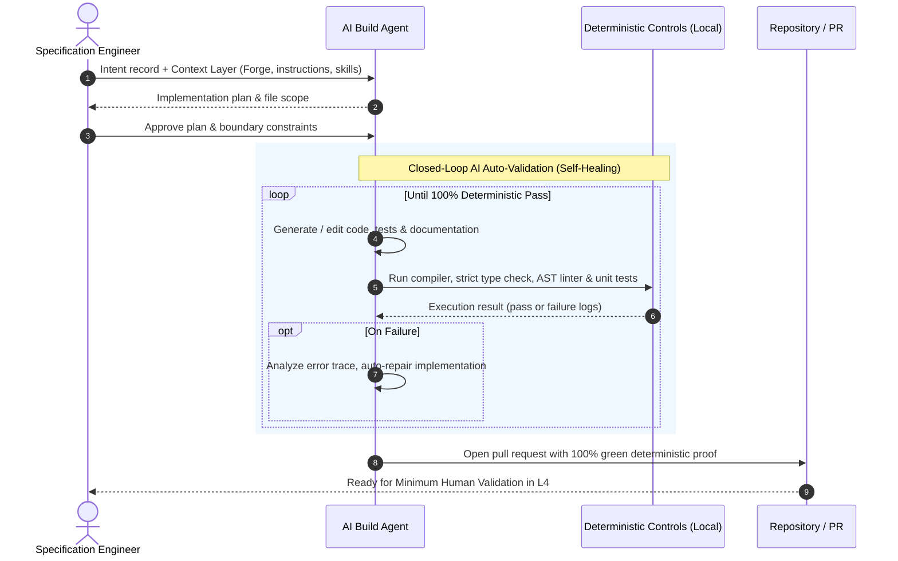

# L3 — Build

Where intent becomes code. In Flow Stack, **developers do not code anymore**: AI agents autonomously
generate 100% of the code, tests, and documentation, operating in closed self-healing loops against
dense deterministic controls.

## Purpose

| Input | Output | Owner |
|---|---|---|
| A work item that passed the [Intent](./layer-intent) gate + the [Context Layer](./context-layer) | A verified pull request with code, comprehensive tests, and documentation that passes all local deterministic controls | Specification engineer (supervising autonomous AI agents) |

## The autonomous build loop

1. **Plan first.** The AI agent reviews the Intent record and the Context Layer, proposing a detailed
   plan (affected files, interfaces, and test strategy). The specification engineer validates scope
   in seconds.
2. **Autonomous generation.** The agent autonomously generates the application logic, database
   migrations, tests, and documentation. No human developer writes code syntax.
3. **Closed-loop auto-validation.** The agent runs the local deterministic control harness (type
   checker, linter, unit and contract tests). If any control fails, the agent parses the failure,
   repairs the code, and re-runs the controls automatically without human intervention.
4. **Context alignment.** The [Context Layer](./context-layer) enforces codebase idioms, architectural
   boundaries, and library choices so the generated code is consistent with the existing system.
5. **Committed proof.** Once all local deterministic controls pass, the agent commits the change,
   opens a pull request, and hands off to [L4 Proof](./layer-proof).

## Where AI is used

Writing software syntax is entirely delegated to AI agents:

| Task | AI share | Human role (Specification Engineer) |
|---|---|---|
| Domain logic and application services | **100%** | Validate intent fidelity against client meeting |
| Scaffolding, boilerplate, wiring | **100%** | Zero human involvement |
| Unit, integration, and contract tests | **100%** | Verify tests derive from intent criteria |
| API clients, DTOs, mappers, migrations | **100%** | Ensure backwards compatibility constraints are met |
| Architectural refactoring within patterns | **100%** | Confirm system boundaries |
| Documentation, OpenAPI specs, runbooks | **100%** | High-level review for clarity |
| Self-healing bug fixes and syntax repairs | **100%** | Intervene only if the agent reaches iteration limit |

## Non-negotiable rules

- **Developers do not write manual code.** Any attempt to manually hand-craft code in an IDE is an
  anti-pattern that bypasses the Context Layer and slows down delivery.
- **Self-healing before PR.** An agent is never permitted to open a pull request with failing
  compilation, linting, or broken tests. The agent must resolve errors deterministically.
- **Tests are generated alongside code, never retrofitted.** Tests are derived strictly from the
  acceptance criteria in the Intent record, not generated as an afterthought to fit the code.
- **Context is the steering wheel.** If an agent produces incorrect code or misunderstands a pattern,
  the engineer updates the [Context Layer](./context-layer) (instructions or skills) rather than
  manually fixing the files.
- **Dependencies are bounded.** Any new dependency introduced by an agent must be explicitly declared
  in the plan and evaluated against security and licensing guardrails.

## Branching

Short-lived feature branches created directly by agents from `main`, merged through pull requests.
Long-running branches are forbidden: they create merge conflicts that break agentic context.

## Exit gate

A pull request leaves Build and enters [Proof](./layer-proof) when:

1. 100% of the code, tests, and documentation are generated by the agent,
2. all acceptance criteria have corresponding automated tests,
3. the complete local deterministic control harness passes with zero warnings or errors,
4. the agent produces a structured summary of changes mapped directly to the original client meeting intent.
