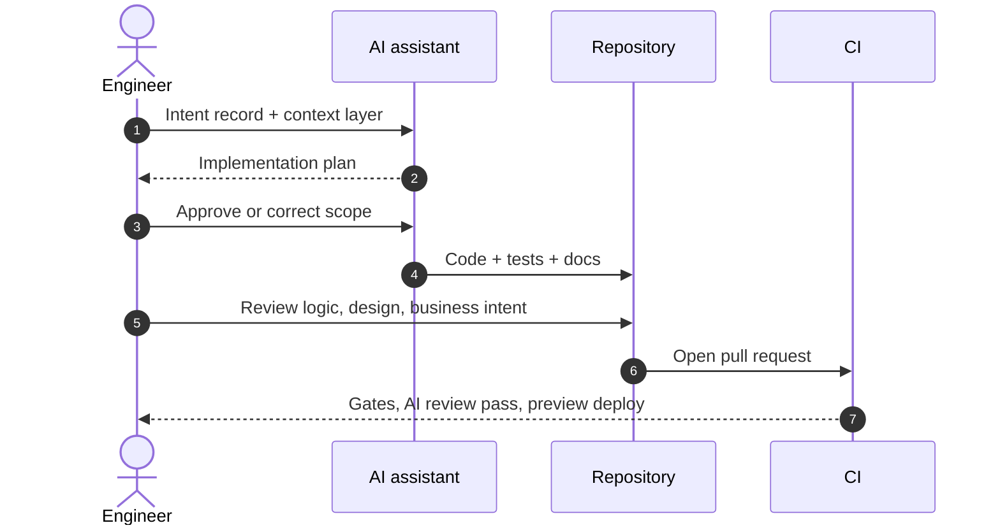

# L3 — Build

Where intent becomes code. This is the layer Flow Stack automates hardest, because generation is
the cheapest part of the system and the least valuable place to spend human attention.

## Purpose

| Input | Output | Owner |
|---|---|---|
| A work item that passed the [Intent](./layer-intent) gate | A pull request with code, tests, and documentation | Engineer |

## The loop

1. **Plan first.** The assistant proposes an implementation plan before touching files. The engineer
   corrects scope here, where correction costs seconds.
2. **Generate against context.** The [Context Layer](./context-layer) supplies conventions, so the
   output matches the codebase instead of matching the internet.
3. **Generate tests with the code**, never after. Tests derive from the acceptance criteria, not
   from the implementation.
4. **Review by intent.** The engineer reads for logic, design, and business alignment — not for
   formatting, which the pipeline already owns.
5. **Commit small.** One work item, one pull request, ideally under a day of flow time.

## Where AI is used

| Task | Typical AI share |
|---|---|
| Boilerplate, scaffolding, wiring | High |
| Unit and integration test generation | High |
| API clients, DTOs, mappers, migrations | High |
| Refactoring within a known pattern | High |
| Documentation and release notes | High |
| Bug root-cause analysis | Medium |
| Cross-cutting architecture change | Low |
| Security-sensitive logic | Low, always human-authored review |

## Non-negotiable rules

- **AI accelerates the work; humans own correctness, architecture, and the final merge.**
- No merge without a human who can explain the change without the assistant open.
- Generated code that the engineer cannot justify is deleted, not merged "because tests pass".
- Secrets, credentials, and customer data never enter a prompt. See [Guardrails](./guardrails).
- Every dependency an assistant adds is reviewed like a dependency a human adds.

## Branching

Short-lived branches from `main`, merged through a pull request. Long-running branches are a flow
defect: they batch risk and defeat progressive delivery in [Release](./layer-release).

## Exit gate

A pull request leaves Build when:

1. all acceptance criteria have a corresponding test,
2. the pipeline is green including the security scan,
3. a human reviewer has approved at the level the blast radius requires,
4. documentation affected by the change is updated in the same pull request.
