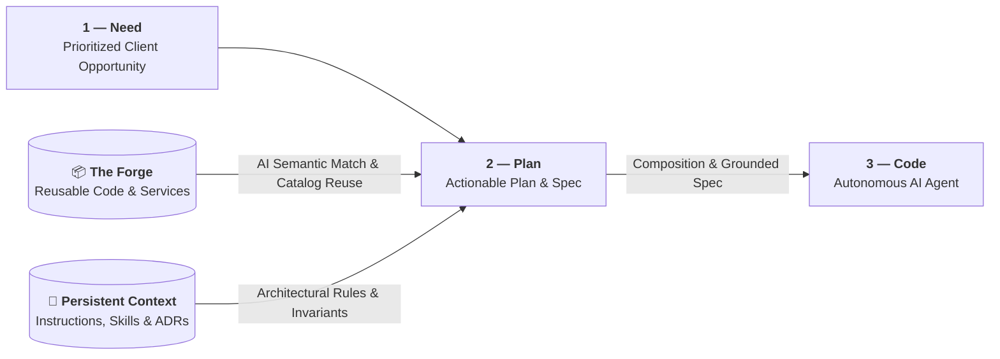

# 2 — Plan

Where a prioritized client need becomes an actionable, machine-testable plan and formal specification
that AI can autonomously build and deterministic controls can prove. Rather than planning bespoke code
from scratch, **Plan combines two enterprise pillars**: **[The Forge](#enterprise-foundations-the-forge-persistent-context)**
(an organizational catalog of reusable code, hardened services, and verified contracts) and the
**[Persistent Context Layer](./context-layer)** (committed repository instructions, specialized agent skills,
existing specs, and ADR invariants). Plan replaces vague user stories with formal, machine-testable statements,
reusable component bindings, and AI-generated architectural plans grounded in codebase truth.

## Purpose

| Input | Output | Owner |
|---|---|---|
| A prioritized opportunity from [1 — Need](./layer-need) + **The Enterprise Forge** (reusable services, modules, contracts) + **Persistent Context** (instructions, skills, ADRs, existing specs) | A structured Plan record with problem, outcome metric, **Forge asset bindings**, Context Layer constraints, deterministic acceptance criteria, and an implementation plan | Product lead + specification engineer |

## The Plan record

Every work item carries six formal fields. Because developers do not write code syntax manually, the
completeness and testability of these fields are the primary levers of software quality.

| Field | Content | Length |
|---|---|---|
| **Problem** | Who is blocked, what they said in the client meeting, and what it costs them | 2–3 sentences + citation |
| **Outcome metric** | The objective number or telemetry metric that moves if this succeeds | 1 line |
| **Forge asset bindings** | Pre-approved reusable services, shared modules, and API contracts composed into this plan | List of Forge references |
| **Acceptance criteria** | Deterministically observable behaviours, written as executable assertions | 3–8 assertions |
| **Constraints** | Security, compliance, latency, schema compatibility, budget limits | Bullets |
| **Out of scope** | Explicit non-goals preventing agent scope creep | Bullets |

### Deterministic criteria example

Acceptance criteria are written so that test generators and deterministic testbeds can execute them
without subjective interpretation:

```gherkin
- Given unauthenticated request to GET /api/v1/orders, then response is 401 Unauthorized with empty body.
- Given authenticated user with role `viewer`, when sending POST /api/v1/orders, then response is 403 Forbidden.
- Given valid order payload with known product ID, when POST /api/v1/orders, then response is 201 Created and exactly one `order.created` event is published with schema v2.
- Given order payload with unknown product ID, when POST /api/v1/orders, then response is 400 Bad Request, no database row is written, and error code is `ERR_PRODUCT_NOT_FOUND`.
```

## Enterprise foundations: The Forge & Persistent Context

Writing bespoke software or planning in an informational void are primary anti-patterns in an industrialized factory.
In the Plan phase, squads ground every plan in two complementary enterprise assets:



### 1. The Forge (What we reuse)
The Forge provides three tiers of certified building blocks, centering on **reusable code** and **in-context templates**:
1. **Shared Enterprise Services**: Production-hardened microservices (authentication, identity, billing, audit logging, notification dispatch, document storage).
2. **Reusable Code Modules & In-Context Templates**: Validated domain logic, cryptographic utilities, telemetry wrappers, and architectural scaffolding templates (e.g., frameworks like **Gatelin** or **foxnox**) injected directly into agent context.
3. **Interface Contracts & Schemas**: Versioned OpenAPI, gRPC, and AsyncAPI specifications that ensure cross-service compatibility before generation begins.

### 2. Persistent Context (How we plan)
Provisioned and kept synchronized across repositories via persistent context and agent catalogs (e.g., **`coding-pal`**), the [Context Layer](./context-layer) ensures planning obeys repository reality:
1. **Architecture Decision Records (ADRs)**: Invariants that constrain technology choices, state management, and communication patterns.
2. **Existing System Specifications**: Ground-truth documentation of current behavior to prevent regressions.
3. **Specialized Agent Skills & Catalogs**: Curated agent personas and structured workflows that guide the LLM to identify edge cases, performance bottlenecks, and security boundaries.

### How they work together in Plan
- **Semantic Discovery & Binding**: When drafting the technical plan, the LLM searches The Forge for reusable assets and checks Persistent Context for architectural invariants.
- **Composition over Custom Code**: Specification engineers mandate composing existing Forge services rather than generating bespoke logic.
- **Zero-Ambiguity Contract Locking**: Interface schemas from The Forge and constraints from Persistent Context are locked in the Plan record before entering [3 — Code](./layer-code).

## Where AI is used

AI translates client dialogue into formal specifications and technical plans; the specification
engineer ensures architectural soundness and strict testability.

| Task | AI role | Human role (Specification / Planning Engineer) |
|---|---|---|
| **Meeting-to-Plan translation** | Parse client meeting transcript, draft problem definition and acceptance criteria | Validate that technical criteria faithfully represent client needs |
| **Forge discovery & composition** | Semantically query The Forge catalog, match reusable code modules and shared services to requirements | Confirm asset suitability, avoid duplicate development, approve integration bindings |
| **Technical design & plan** | Scan codebase, Forge assets, and Context Layer; draft implementation plan across files | Validate architectural approach and component boundaries |
| **Edge-case & invariant discovery** | Enumerate boundary conditions, race conditions, null states, and error handling | Decide which edge cases are mandatory in scope |
| **Deterministic criteria specification** | Convert business requirements into observable, boolean acceptance assertions | Ensure assertions are rigorous and machine-verifiable |
| **Ambiguity detection** | Flag criteria that are subjective, unfalsifiable, or lacking observable side effects | Rewrite them into strict boolean or contract assertions |
| **Impact & contract analysis** | Detect affected APIs, database schemas, message queues, and consumer dependencies | Confirm blast radius and trigger ADR if boundaries shift |

::: tip
The ambiguity detection pass is the highest-leverage AI capability in this layer: it catches
unfalsifiable requirements before the build agent writes a single line of code.
:::

## Architectural decisions (ADRs)

If an implementation requires altering a public API, changing a database schema, or shifting service
boundaries, AI drafts an Architecture Decision Record (ADR) based on repository conventions. The
architect or specification engineer reviews and signs the ADR, which is committed into the repository
to immediately enrich the [Context Layer](./context-layer).

## Exit gate

A work item leaves Plan and enters [3 — Code](./layer-code) only when:

1. every acceptance criterion is deterministically observable and machine-verifiable,
2. reusable code modules and shared services from **The Forge** have been evaluated and bound to the Plan where applicable,
3. architectural constraints, domain specs, and invariants from the **Persistent Context Layer** are validated,
4. blast radius is classified and the required level of minimum human validation is assigned ([Decision Rights](./decision-rights)),
5. an AI implementation plan has been reviewed and approved by the specification engineer,
6. all architectural changes are recorded in an ADR committed to the Context Layer.
