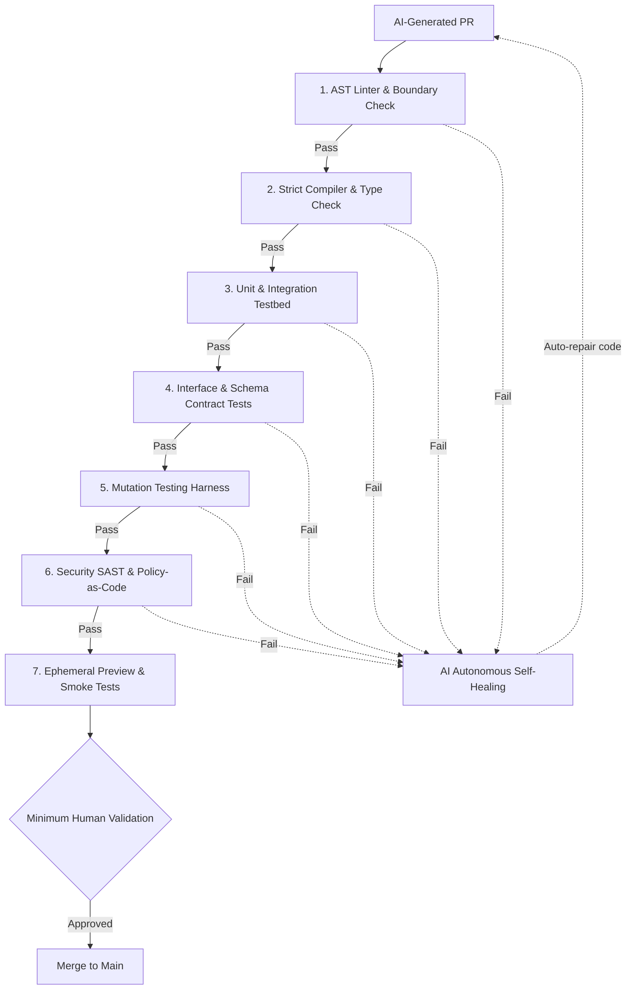

# L4 — Proof

Quality is not a phase and not a human line-by-line reading marathon. In Flow Stack, Proof is the
layer that combines **dense deterministic controls for AI auto-validation** with **minimum human
validation** to guarantee that generated software is correct, safe, and aligned with client intent.

## Purpose

| Input | Output | Owner |
|---|---|---|
| A pull request from [Build](./layer-build) | Deterministic mathematical and behavioural proof of correctness, followed by minimum human sign-off on intent | The squad + platform deterministic harness |

## Why deterministic controls replace manual code review

When code is generated autonomously by AI, requiring humans to manually read syntax line-by-line is
a dangerous anti-pattern:
- **Reviewer fatigue**: Humans skimming large diffs miss subtle logic flaws and hallucinated assumptions.
- **Cognitive bottleneck**: Delivery velocity collapses back to the speed of manual reading.
- **False security**: "Looks good to me" provides zero mathematical guarantee.

Flow Stack solves this by shifting the verification burden to **dense, objective, deterministic
controls** that execute in closed loops, reserving human attention strictly for high-level business
intent and safety boundaries.

## The deterministic control harness

Deterministic controls are binary: they either pass or fail with absolute certainty. No probabilistic
guesswork is permitted.

### The deterministic gates

| Gate | Type | Enforcement | What it proves |
|---|---|---|---|
| **AST Linter & Structural Rules** | Deterministic | Biome / ESLint / AST rules | Enforces strict syntax, complexity limits, forbidden patterns, and architecture boundaries |
| **Strict Type System** | Deterministic | TypeScript / Rust / Go compiler | Proves compile-time contract integrity, null-safety, and type exhaustiveness |
| **Unit & Logic Tests** | Deterministic | Test runner | Verifies domain logic against the exact criteria specified in the Intent record |
| **Containerized Integration Tests** | Deterministic | Dockerized testbeds | Validates real interaction between services, databases, and message queues |
| **Contract & Schema Tests** | Deterministic | OpenAPI / JSON Schema / Pact | Guarantees that public interfaces and consumer contracts never break silently |
| **Mutation Testing** | Deterministic | Stryker / Mutmut | **Proves the tests themselves**: introduces mutants into code; tests must catch and kill them |
| **Security & Policy-as-Code** | Deterministic | Semgrep / Trivy / OPA Conftest | Verifies absence of known CVEs, secrets, and policy violations |
| **Preview Smoke Tests** | Deterministic | Ephemeral preview | Proves the application starts, routes traffic, and responds to health checks |

## Closed-loop AI auto-validation

If any deterministic gate fails in CI, the AI agent is automatically triggered with the error
diagnostics. The agent:
1. reads the compiler trace, linter failure, or failing test assertion,
2. diagnoses the exact fault,
3. autonomously rewrites the code or fixes the test,
4. commits the update and re-triggers the deterministic harness.

This cycle repeats automatically until **100% of deterministic controls pass**. Humans are never
called to troubleshoot trivial compilation or formatting failures.

## Minimum human validation

Once all deterministic controls are green, the pull request enters **Minimum Human Validation**.
Reviewers **do not read syntax line-by-line**. Instead, human validation is restricted to three
specific questions:

1. **Client Intent**: Does this feature faithfully deliver what the client requested in the meeting?
2. **Behavioral Experience**: Does the live preview environment look, behave, and feel right?
3. **Safety & Blast Radius**: Does the change respect operational constraints and carry a clean rollback path?

### Risk-weighted human validation

| Blast radius | Criteria | Required human validation |
|---|---|---|
| **Low** | Internal refactor, non-breaking schema change, copy edit behind green deterministic tests | **Zero-touch auto-merge** or 1-click squad acknowledgement |
| **Medium** | New public endpoint, schema addition, integration with external vendor | **Single-person validation**: Specification engineer verifies client intent and preview environment |
| **High** | Auth, permissions, billing, PII processing, data migration | **Dual validation**: Specification engineer + security owner verify business intent, access boundaries, and rollback plan |
| **Critical** | Irreversible data migration, breaking public contract, infrastructure change | **Lead sign-off**: Engineering lead + product lead approve business continuity and staged canary rollout |

## The bug rule

Every production defect must result in a new **deterministic control** (a failing test case, a strict
linter rule, or a schema validator) committed before the fix. The AI agent fixes the code to satisfy
the new deterministic control, guaranteeing the bug cannot recur.

## Exit gate

A change leaves Proof and enters [Release](./layer-release) when:

1. 100% of deterministic gates are green (zero warnings, zero mutations survived, zero security alerts),
2. minimum human validation is recorded at the level required by the blast radius,
3. an automated rollback mechanism is validated.
