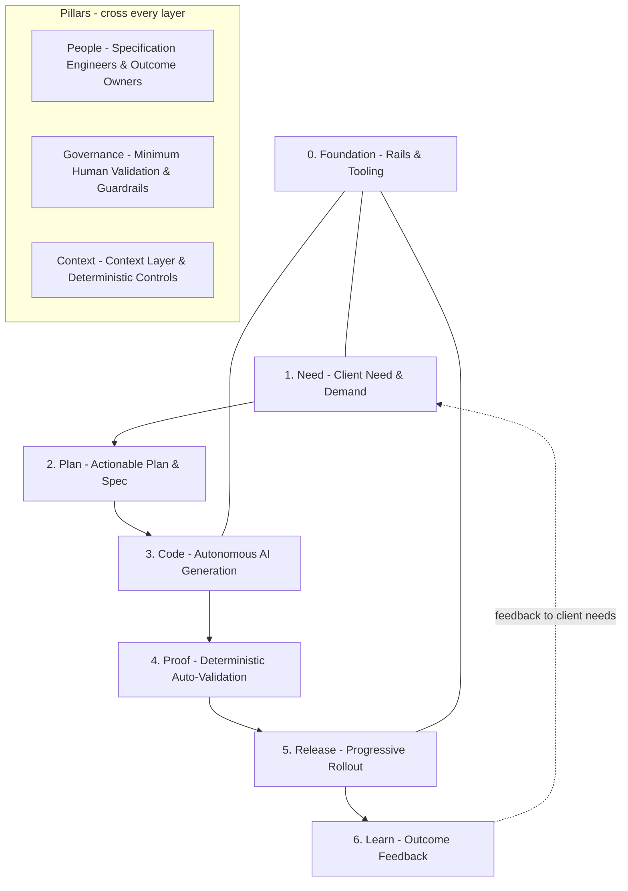

# Overview

Agentic Software Factory is an **operating model**: the way a software organization actually works to deliver,
support, and improve software. It defines how people, processes, tools, decisions, and
responsibilities fit together.

It is not an architecture, not a methodology certificate, and not a tool. It is the organizational
and process architecture behind building and running software — rebuilt for a world where **AI is
leveraged at maximum capability across the entire lifecycle, from the client meeting to release**.

> **Agentic Software Factory is the modern operating model that connects client dialogue, autonomous AI execution,
> deterministic verification, and continuous delivery into one continuous system.**

## The core pillars of the model

Agentic Software Factory is built around four fundamental shifts:

1. **Meeting-Driven Development**: Software development begins directly in the client or stakeholder
   meeting. AI captures, transcribes, and extracts business intent into structured specifications,
   eliminating the telephone game of manual ticket writing and backlog grooming.
2. **Zero Developer Coding**: Developers **do not write code syntax anymore**. Engineers operate as
   **Specification Engineers**, **Context Architects**, and **Deterministic Control Builders**,
   while AI agents autonomously generate 100% of code, tests, and documentation.
3. **Dense Deterministic Controls for AI Auto-Validation**: Rather than relying on fuzzy prompts or
   superficial AI self-review, the platform establishes dense, binary, non-probabilistic controls:
   compilers, strict type systems, AST linters, contract verifications, mutation testing, and
   security scanners. AI agents execute against these controls in closed self-healing loops until
   every gate passes.
4. **Minimum Human Validation**: Manual line-by-line code review of generated code is an obsolete
   bottleneck. Once deterministic controls auto-validate 100% of the implementation, humans perform
   targeted validation strictly on business intent, user experience, and risk invariants.

### The three foundational enablers

The autonomous delivery pipeline is underpinned by three persistent enabler layers:
- **[The Forge](./layer-plan#reusable-assets-the-enterprise-forge)**: Reusable microservices, hardened modules, and certified interface contracts that empower the Plan and Code phases.
- **[Persistent Context Layer](./context-layer)**: Committed repository instructions, specialized agent skills, existing specs, and ADRs that govern Plan, Code, and Proof self-repair.
- **[Deterministic Controls](./guardrails)**: Ungameable automated testbeds, strict type-checks, interface contracts, and mutation suites that auto-validate generated software in closed loops before minimum human sign-off.

## Why the name

- **Agentic** — autonomous AI agents driving implementation, testing, and self-healing in closed loops.
- **Software Factory** — an industrialized, repeatable system where software moves predictably from client intent to verified production release through layered gates.

## The shape of the model

Agentic Software Factory is made of **seven layers** crossed by **three pillars**.



| Stage | Question it answers |
|---|---|
| [0 — Foundation](./layer-foundation) | What does every squad get for free? |
| [1 — Need](./layer-need) | What does the client actually need, and what is worth doing? |
| [2 — Plan](./layer-plan) | What are we building, what Forge assets and Persistent Context can we compose, and what are the deterministic criteria? |
| [3 — Code](./layer-code) | How do AI agents autonomously generate the implementation using The Forge and Persistent Context? |
| [4 — Proof](./layer-proof) | How do deterministic controls auto-validate the change, and where is minimum human validation applied? |
| [5 — Release](./layer-release) | How does it reach users progressively without risk? |
| [6 — Learn](./layer-learn) | What did reality say, and how does it refine client needs, The Forge, and the Context Layer? |

| Pillar | Owns | Reference |
|---|---|---|
| People | Squad shape, specification engineering, minimum human sign-off | [Squads](./squads) |
| Governance | Decision rights, AI policy, blast-radius risk gates | [Decision Rights](./decision-rights) |
| Context | Instructions, skills, agents, specs, deterministic testbeds | [Context Layer](./context-layer) |

## What is different from a classic software organization

A classic organization relies on manual coding, tribal knowledge, and labor-intensive reviews.
Agentic Software Factory reorganizes every role around maximum AI capability:

| Classic organization | Agentic Software Factory |
|---|---|
| Developers write syntax manually in an IDE | Developers **do not code**; AI generates 100% of code, tests, and docs |
| Engineers spend hours on line-by-line PR reviews | Dense **deterministic controls auto-validate**; humans do **minimum validation** on intent |
| Requirements lost in manual tickets and hand-offs | **Meeting-Driven Development**: AI transcribes and structures client meetings into formal Intent |
| Knowledge lives in heads, chats, and outdated wikis | Knowledge lives in the committed [Context Layer](./context-layer) (instructions, skills, specs) |
| AI used ad hoc as an autocomplete assistant | Autonomous AI agents operate with closed-loop self-healing under platform guardrails |
| Velocity measured in story points and PR volume | Flow measured in meeting-to-release lead time, deterministic pass rates, and customer outcomes |

## The core constraint

When code generation becomes autonomous and cheap, the bottleneck moves. It is never *writing* code;
it is **capturing true client intent, and proving deterministically that what was generated satisfies it**.

Agentic Software Factory therefore invests heavily in:
- **Need / Plan (Meeting-Driven Intent)**: Capturing client needs directly through AI synthesis, composing from reusable Forge assets and repository Persistent Context, and transforming them into unambiguous, testable specifications.
- **Code (Autonomous Generation)**: Leveraging bound Forge packages and repository Context Layer skills so AI agents generate 100% of code without reinventing wheels.
- **Proof (Deterministic Auto-Validation)**: Building dense, ungameable deterministic harnesses that auto-validate AI generation in closed self-healing loops before asking for minimum human sign-off.

```
Client Meeting  →  1. Need  →  2. Plan  →  3. Code (AI)  →  4. Proof (Auto-Val)  →  5. Release  →  6. Learn
      |                ^^^^        ^^^^                             ^^^^^                             |
      +--------------> Human Intent Validation                    Minimum Human Sign-off              |
                                                                            |                         |
                                                                            +-------------------------+
```

## Where to go next

- New to the model: read [Principles](./principles), then walk Stages 1 → 6 (Need → Learn).
- Adopting it in an existing organization: start with the [Adoption Roadmap](./adoption).
