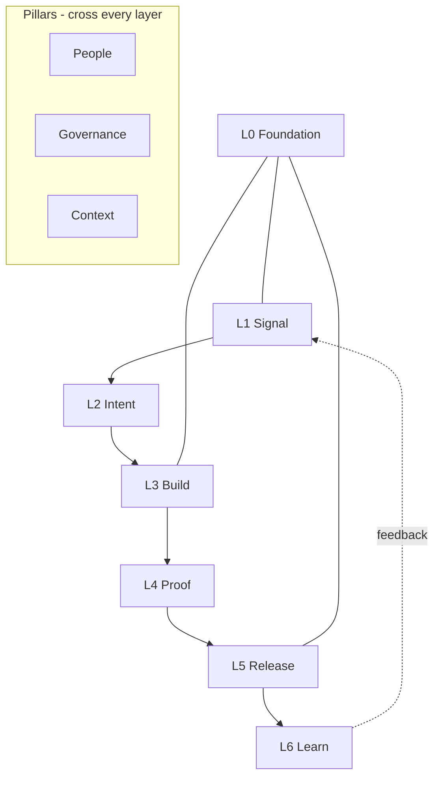

# Overview

Flow Stack is an **operating model**: the way a software organization actually works to deliver,
support, and improve software. It defines how people, processes, tools, decisions, and
responsibilities fit together.

It is not an architecture, not a methodology certificate, and not a tool. It is the organizational
and process architecture behind building and running software — rebuilt for a world where a large
share of the work is produced by AI and validated by humans.

> **Flow Stack is the operating layer that connects strategy, execution, AI, and delivery into one
> continuous system.**

## Why the name

- **Flow** — movement, momentum, value moving from an idea to a customer without friction.
- **Stack** — a layered system where each layer has an owner, an input, an output, and a gate.

Work *flows* through the *stack*. The stack is stable; the flow is continuous.

## The shape of the model

Flow Stack is made of **seven layers** crossed by **three pillars**.



| Layer | Name | Question it answers |
|---|---|---|
| L0 | [Foundation](./layer-foundation) | What does every squad get for free? |
| L1 | [Signal](./layer-signal) | What is worth doing? |
| L2 | [Intent](./layer-intent) | What exactly are we building, and how will we know it works? |
| L3 | [Build](./layer-build) | How is it implemented? |
| L4 | [Proof](./layer-proof) | Why do we believe it is correct and safe? |
| L5 | [Release](./layer-release) | How does it reach users without risk? |
| L6 | [Learn](./layer-learn) | What did reality say, and what changes because of it? |

| Pillar | Owns | Reference |
|---|---|---|
| People | Squad shape, ownership, enablement functions | [Squads](./squads) |
| Governance | Decision rights, AI policy, risk gates | [Decision Rights](./decision-rights) |
| Context | Instructions, skills, agents, specs, evaluation | [Context Layer](./context-layer) |

## What is different from a classic startup model

A classic startup operating model is already lightweight: small teams, direct communication,
continuous deployment, minimal approvals, strong automation. Flow Stack keeps all of that and
changes four things.

| Classic startup | Flow Stack |
|---|---|
| AI used ad hoc, per developer | AI is a platform capability with owners, versions, and budgets |
| Knowledge lives in heads and Slack | Knowledge lives in the [Context Layer](./context-layer), committed to the repository |
| Review effort spread evenly across changes | Review effort concentrated on risk, because volume of generated code is no longer the constraint |
| Velocity measured in stories | Flow measured in lead time, failure rate, and [AI leverage](./metrics) |

## The core constraint

When generation becomes cheap, the bottleneck moves. It is no longer *writing* code; it is
**deciding what to build, and proving that what was built is correct**.

Flow Stack therefore invests deliberately in L1/L2 (deciding) and L4 (proving), and treats L3
(writing) as the layer to automate hardest.

```
Idea  →  Signal  →  Intent  →  Build  →  Proof  →  Release  →  Learn
          ^^^^^^    ^^^^^^              ^^^^^                  |
          human judgement               human judgement        |
                     |                                         |
                     +-----------------------------------------+
```

## Where to go next

- New to the model: read [Principles](./principles), then walk L1 → L6.
- Adopting it in an existing organization: start with the [Adoption Roadmap](./adoption).
- Looking for definitions: see the [Glossary](./glossary).
