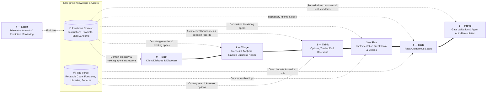
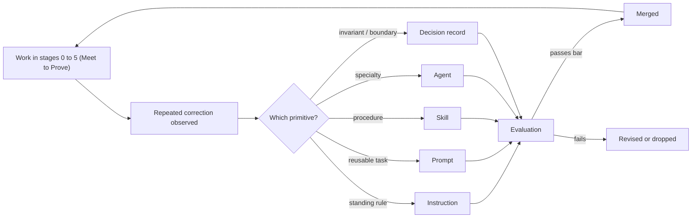

# Persistent Context

Persistent Context is the organization's knowledge in a form a model can consume. It is the single
highest-leverage investment in Agentic Software Factory, and the one most organizations skip in favour of better
prompts.

## Why it exists

A model has no memory of your codebase, your conventions, or your decisions. Every session starts
from zero. Without Persistent Context, each engineer re-explains the same things, differently, forever.

In an operating model where **developers do not code** and **AI writes 100% of the implementation**,
Persistent Context is the primary programming language of the organization.

> Context beats prompting. A well-fed model with committed repository context outperforms a
> well-prompted model with no context.

## Primitives

| Primitive | Loaded | Use for |
|---|---|---|
| **Instruction** | Automatically, when matching files are in context | Stable standards: conventions, structure, security rules, deterministic requirements |
| **Prompt** | Explicitly, invoked by the user | Reusable, parameterised task templates committed to the repository (e.g. draft a Plan record, review a change against decision records) |
| **Skill** | On demand, by name or description | Multi-step workflows with a contract and reusable references (e.g. running mutation tests, generating API schemas) |
| **Agent** | Explicitly selected | A bounded specialist configuration with dedicated tools (e.g. Coding Agent, Remediation Agent, Plan Agent) |

### Knowledge artifacts

Instructions, prompts, skills, and agents are the primitives that steer the model. They draw on three kinds of knowledge artifact:

| Artifact | Loaded | Use for |
|---|---|---|
| **Spec** | Referenced | Ground truth of what the system actually does, kept current with every release |
| **Decision record** | Referenced | Architectural choices, invariants, and rejected alternatives |
| **Context Bundle** | Assembled per work item | The compiled package (Plan record, referenced specs, decision records, active skills, prompts, and instructions) fed to the AI agent |

[Deterministic Controls](./deterministic-controls) are not part of Persistent Context. They are a separate enabler. Agents can run them as skills, such as the guard, gate, contract, and probe skills in [coding-pal](https://alten-group.github.io/coding-pal/), wherever they are cheapest: in their own loop, in a hook, or in the CI.

### Choosing between them

```
Is it a standing rule tied to file types?        → instruction
Is it a reusable task a human triggers on demand? → prompt
Is it a repeatable multi-step procedure?         → skill
Is it a distinct specialty with its own scope?   → agent
Is it a description of existing behaviour?       → spec
Is it the reasoning behind a choice?             → decision record
```

## Persistent Context and The Forge across the stages

Persistent Context supports **[0 — Meet](./stage-meet)** through **[5 — Prove](./stage-prove)**. [The Forge](./forge) supports **[2 — Think](./stage-think)**, **[3 — Plan](./stage-plan)** and **[4 — Code](./stage-code)**. [7 — Learn](./stage-learn) enriches Persistent Context in return:



| Dimension | Persistent Context | The Forge |
|---|---|---|
| **What it represents** | *Domain ground truth, rules & standards* (instructions, prompts, skills, agents, specs, decision records) | *What we reuse* (functions, libraries, services) |
| **Role in 0 — Meet** | Supplies the domain glossary, specs, and meeting agent instructions and prompts, and receives new client terminology back | Not used at this stage |
| **Role in 1 — Triage** | Grounds client dialogue extraction against existing system specs and domain glossaries | Not used at this stage |
| **Role in 2 — Think** | Supplies architectural invariants, decision records, and domain boundaries that bound the options | Identifies candidate shared services and reusable modules to compose instead of building |
| **Role in 3 — Plan** | Informs constraints and non-functional invariants carried into the plan | Supplies the API schemas and bindings to lock into the Plan record |
| **Role in 4 — Code** | Guides AI agents with repository conventions, type rules, and execution skills | Supplies concrete packages, SDKs, and endpoints for agents to import and invoke |
| **Role in 5 — Prove** | Constrains agent auto-remediation loops so automated patches comply with decision records & contracts | Not used at this stage |
| **Role in 7 — Learn** | Receives new instructions, prompts, skills, agents, and decision records from production evidence | Not used at this stage |
| **Storage & Scope** | Versioned inside the repository (`.github/`, `skills/`, `docs/`) and provisioned via persistent context & agent catalogs (e.g. [`coding-pal`](https://alten-group.github.io/coding-pal/)) | Versioned in enterprise package registries, service catalogs, and in-context templates (e.g. `Gatelin`, `foxnox`) |

## Agents catalog

Agents are provisioned through an agents catalog: a curated set of production-ready agents, such as Plan, Coding,
Remediation, and Security agents. Each one is packaged with audited prompts, bounded tools, and the skills for its
role. Platforms like [coding-pal](https://alten-group.github.io/coding-pal/) keep these bundles synchronized across
developer workstations and CI runners, so every team starts from the same set.

## Who owns it

The Architect owns Persistent Context, with every team contributing changes through pull requests.

## Where it lives

In the repository, next to the code it describes, reviewed like the code it describes.

```
<repo>/
  instructions/*.instructions.md
  skills/<name>/SKILL.md
  skills/<name>/references/*.md
  agents/*.agent.md
  docs/specs/*.md
  docs/adr/*.md
```

## Rules

1. **Committed, reviewed, versioned.** A context artifact changes through a pull request.
2. **Evidence-driven.** New artifacts come from [7 — Learn](./stage-learn): something was corrected
   twice, or re-explained twice.
3. **Small and specific.** Instructions that try to cover everything get ignored by models and
   humans alike.
4. **Scoped precisely.** Instructions declare the narrowest matching pattern that works; broad
   patterns waste context on every request.
5. **Deleted when wrong.** An outdated instruction is worse than none: it produces confident,
   consistent, wrong output.
6. **Never contains secrets.** Context artifacts are read by tools and shared across sessions.

## Maintenance loop



No context change is adopted without passing automated evaluation. Persistent Context is code, and
untested code is not merged.

## Health signals

| Signal | Healthy | Unhealthy |
|---|---|---|
| Fix-loop iterations needed | Trending down (1–2 loops) | Flat or above 3 loops |
| Manual human corrections during validation | Near zero | Frequent |
| Instruction count | Stable, each one used | Growing without pruning |
| First-pass green rate in Code | > 80% | < 50% |
| Generated output matching codebase conventions | High | Requires rewriting |
