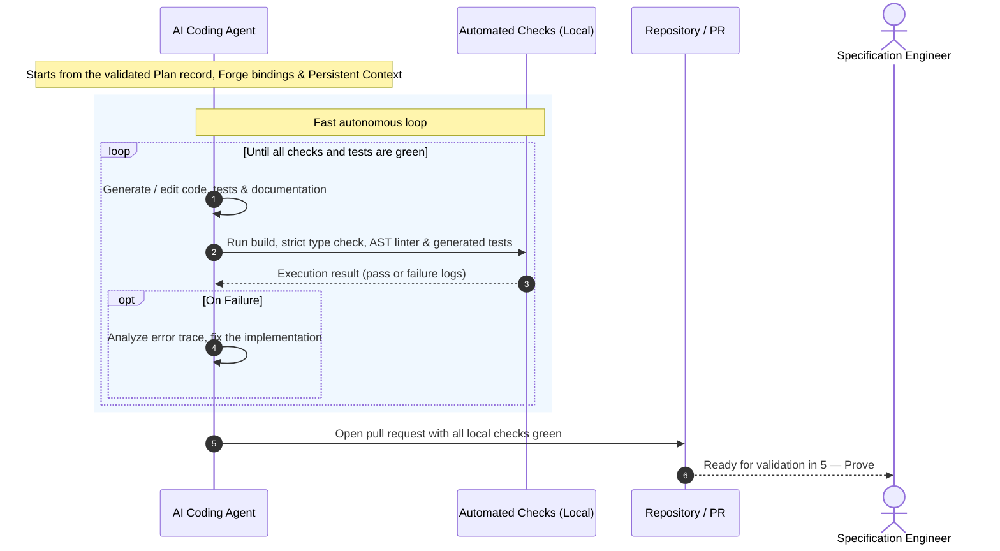

# ⚡ 4 — Code

  STAGE 4
  Fast autonomous loops, generate, test &amp; fix until green

Where specifications and plans become executable software. In Agentic Software Factory, **developers do not code manually**: AI agents autonomously
generate the code, tests, and documentation, iterating in fast, closed loops until every local check and test is green.

## Purpose

| Input | Output | Owner |
|---|---|---|
| A work item that passed the [3 — Plan](./stage-plan) gate and the Validate step, with its Forge bindings carried in the Plan record + **[The Forge](./forge)** (bound functions, libraries, services) + **[Persistent Context](./persistent-context)** (instructions, prompts, skills, agents, repository conventions) | A pull request with code, comprehensive tests, and documentation, with every locally run automated check and test passing | Specification engineer (supervising autonomous AI agents) |

## The autonomous coding loop

The implementation plan was already produced in [3 — Plan](./stage-plan) and validated by the specification engineer before
Code starts, so the loop begins directly with generation.

1. **Autonomous generation.** The agent generates the application logic, database
   migrations, tests, and documentation from the validated Plan record. No human developer writes code syntax.
2. **Fast autonomous loop.** The agent runs the automated checks: build, strict type check, AST linter,
   and the unit and integration tests it generated. If anything fails, the agent parses the failure,
   repairs the code, and re-runs automatically without human intervention, until everything is green.
   These checks give fast feedback. They are not [deterministic controls](./deterministic-controls), which run
   independently of the agent in [5 — Prove](./stage-prove).
3. **Context & Forge alignment.** [Persistent Context](./persistent-context) enforces codebase idioms,
   architectural boundaries, and library choices, while [The Forge](./forge)
   provides the bound functions, libraries, and services, so the generated code is consistent and avoids reinventing wheels.
4. **Committed work.** Once all local checks and tests are green, the agent commits the change,
   opens a pull request, and hands off to [5 — Prove](./stage-prove).

## Enterprise foundations in Code: The Forge & Persistent Context

Autonomous AI agents do not write isolated code in a vacuum. During generation, the agent draws continuously from both enterprise pillars:

- **The Forge (Reusable Code & In-Context Templates)**: The agent directly imports the validated modules, packages, and client SDKs bound in [2 — Think](./stage-think) and carried through the Plan record, leveraging in-context templates (such as those from **Gatelin** or **foxnox**). Rather than hallucinating bespoke utility functions or reinventing authentication and logging logic, the agent wires together verified building blocks.
- **Persistent Context (Instructions, Prompts, Skills & Agents)**: [Persistent Context](./persistent-context) (provisioned through persistent context and agent catalogs like **`coding-pal`**) injects exact repository conventions, style guides, reusable prompts, and specialized developer skills (such as mutation testing or schema generation). The agent outputs syntax that conforms to the existing codebase without human hand-crafting.

## Non-negotiable rules

- **Developers do not write manual code.** Any attempt to manually hand-craft code in an IDE is an
  anti-pattern that bypasses Persistent Context and slows down delivery.
- **Green before PR.** An agent is never permitted to open a pull request with a failing build,
  type error, lint failure, or failing test. The agent keeps iterating until they pass, up to the
  fix-loop limit in [Deterministic Controls](./deterministic-controls#ai-agent-execution-guardrails).
- **Tests are generated alongside code, never retrofitted.** Tests are derived strictly from the
  acceptance criteria in the Plan record, not generated as an afterthought to fit the code.
- **Context is the steering wheel.** If an agent produces incorrect code or misunderstands a pattern,
  the engineer updates [Persistent Context](./persistent-context) (instructions, prompts, or skills) rather than
  manually fixing the files.
- **Dependencies are bounded.** Any new dependency introduced by an agent must be explicitly declared
  in the plan and evaluated against security and licensing controls.

## Branching

Short-lived feature branches created directly by agents from `main`, merged through pull requests.
Long-running branches are forbidden: they create merge conflicts that break agentic context.

## Where AI is used

Writing software syntax is delegated to AI agents:

| Task | AI role | Human role (Specification engineer) |
|---|---|---|
| Domain logic and application services | Generate from the Plan record | Validate fidelity to the Plan acceptance criteria |
| Scaffolding, boilerplate, wiring | Generate from Forge templates | None |
| Unit, integration, and contract tests | Generate alongside the code, from the acceptance criteria | Verify tests derive from the acceptance criteria |
| API clients, DTOs (data transfer objects), mappers, migrations | Generate against Forge contracts | Ensure backwards compatibility constraints are met |
| Architectural refactoring within patterns | Refactor inside the recorded boundaries | Confirm system boundaries |
| Documentation, OpenAPI specs, runbooks | Generate | Review for clarity |
| Fix loops on failing builds, type errors, lint failures, and tests | Parse the failure and repair | Intervene only if the agent reaches the fix-loop limit |

## Exit gate

A pull request leaves Code and enters [Prove](./stage-prove) when:

1. the code, tests, and documentation are generated by the agent, composing bound Forge assets and obeying Persistent Context rules,
2. all acceptance criteria from the Plan record have corresponding automated tests,
3. the build, strict type check, linter, and all generated tests pass locally with zero errors,
4. the agent produces a structured summary of changes mapped directly to the client evidence cited in the Plan record.

**Previous:** [3 — Plan](./stage-plan) · **Next:** [5 — Prove](./stage-prove)
