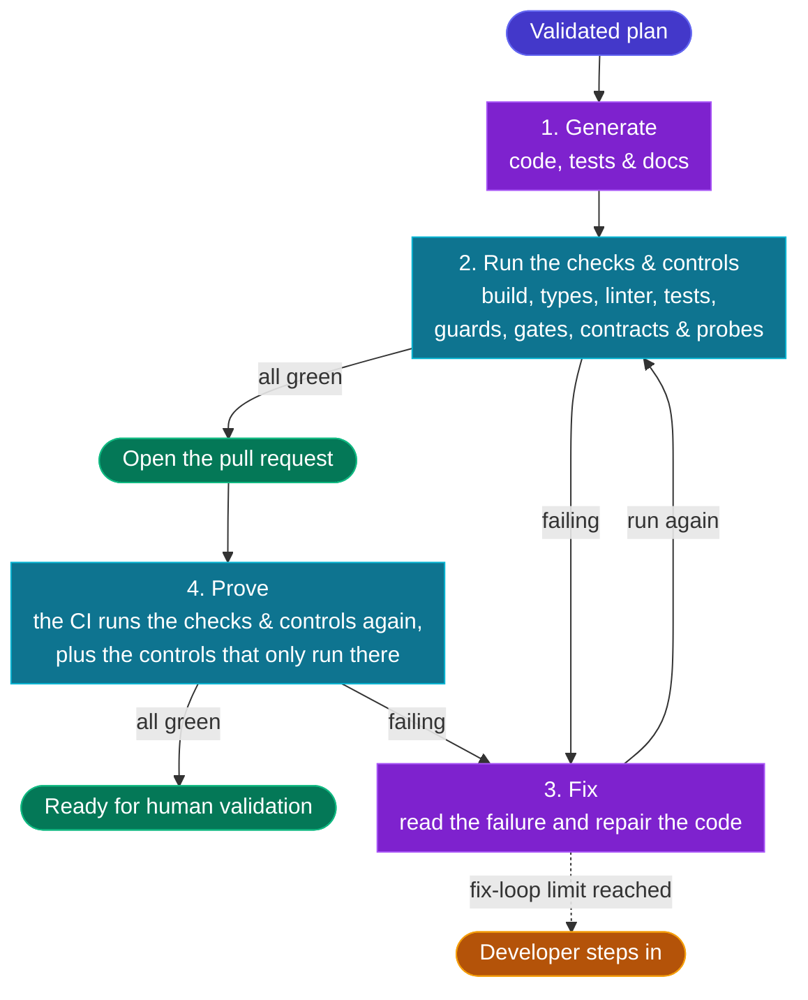

# ⚡ 4 — Code

  STAGE 4
  Fast autonomous loops, generate, test &amp; fix until green

Where specifications and plans become executable software. In Agentic Software Factory, **developers do not code manually**: AI agents autonomously
generate the code, tests, and documentation, iterating in fast, closed loops until all checks, tests and controls are green.

## Purpose

| Input | Output | Owner |
|---|---|---|
| A work item that passed the [3 — Plan](./stage-plan) gate | A pull request with all CI checks passing | Developer (supervising autonomous AI agents) |

## The autonomous coding loop

1. **Autonomous generation.** The agent generates code, database
   migrations, tests, and documentation from the validated Plan record. No human developer writes code syntax.
2. **Fast autonomous loop.** The agent runs the automated checks (build, type check, linter, and tests) and the [deterministic controls](./deterministic-controls) (guards, gates, contracts, and probes),
   usually as skills it calls itself. Running them here costs seconds, not a CI cycle. If anything fails, the agent
   reads the failure, repairs the code, and runs everything again, without human intervention, until it is all green.
3. **Context & Forge.** The agent follows [Persistent Context](./persistent-context) and imports the assets bound in
   Think from [the Forge](./forge).
4. **Committed work.** Once everything is green, the agent commits the change and opens the pull request.
   The CI then runs the checks and controls again, plus the controls that only run there. If they fail, the agent fixes the code and the loop runs again. The developer steps in only when the fix-loop limit is reached.

## Non-negotiable rules

- **Developers do not write manual code.** Any attempt to manually hand-craft code in an IDE is an
  anti-pattern that bypasses Persistent Context and slows down delivery.
- **Green before PR.** An agent is never permitted to open a pull request with a failing build,
  type error, lint failure, failing test, or failing control. The agent keeps iterating until they pass, up to the
  fix-loop limit.
- **Tests are generated alongside code, never retrofitted.** Tests are derived strictly from the
  acceptance criteria in the Plan record, not generated as an afterthought to fit the code.
- **Context is the steering wheel.** If an agent produces incorrect code or misunderstands a pattern,
  the engineer updates [Persistent Context](./persistent-context) (instructions, prompts, or skills) rather than
  manually fixing the code.
- **Dependencies are bounded.** Any new dependency introduced by an agent must be explicitly declared
  in the plan and evaluated against security and licensing controls.

## Branching

Short-lived feature branches created directly by agents from `main` or `develop`, merged through pull requests.
Long-running branches are forbidden: they create merge conflicts that break agentic context.

## Where AI is used

| Task | AI role | Human role |
|---|---|---|
| Domain logic and application services | Generate from the Plan record | Validate fidelity to the Plan acceptance criteria |
| Scaffolding, boilerplate, wiring | Generate from Forge templates | None |
| Unit, integration, and contract tests | Generate alongside the code, from the acceptance criteria | Verify tests derive from the acceptance criteria |
| API clients, DTOs, mappers, migrations | Generate against Forge contracts | Ensure backwards compatibility constraints are met |
| Architectural refactoring within patterns | Refactor inside the recorded boundaries | Confirm system boundaries |
| Documentation, OpenAPI specs, runbooks | Generate | Review for clarity |
| Fix loops on failing builds, type errors, lint failures, and tests | Parse the failure and repair | Intervene only if the agent reaches its limit |

## Exit gate

A pull request leaves Code and enters [Prove](./stage-prove) when:

1. the agent has generated code, tests, and documentation from the validated Plan, using bound Forge assets where applicable and following the instructions and constraints in Persistent Context,
2. all acceptance criteria from the Plan record have corresponding automated tests,
3. the build, type check, linter, generated tests, and deterministic controls all pass with zero errors,
4. the pull request links to the backlog issue and the Plan.
