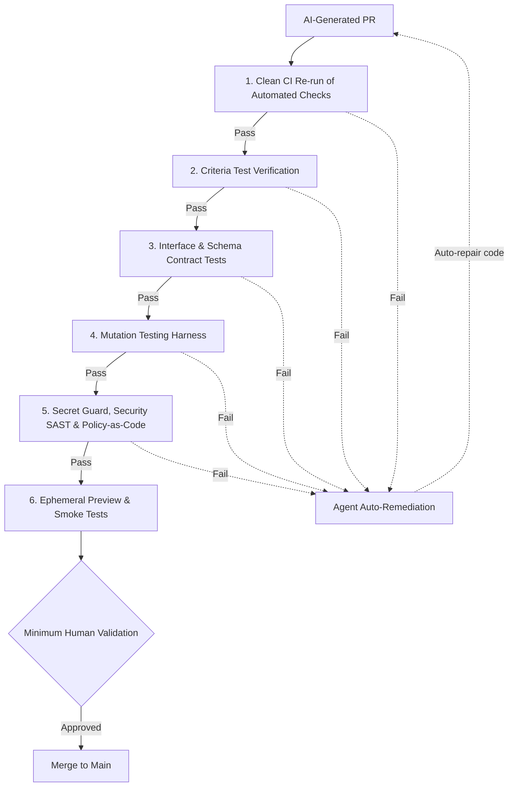

# ✅ 5 — Prove

  STAGE 5
  Deterministic gate validation &amp; agent auto-remediation

Quality is not a phase and not a human line-by-line reading marathon. In Agentic Software Factory, Prove is the
stage that combines **dense deterministic controls for AI auto-validation** with **minimum human
validation** to guarantee that generated software is correct, safe, and aligned with client intent.

## Purpose

| Input | Output | Owner |
|---|---|---|
| A pull request from [4 — Code](./stage-code) + **[Deterministic Controls](./deterministic-controls)** (guards, gates, contracts & probes) + **[Persistent Context](./persistent-context)** (ADRs, architectural invariants, repair instructions) | Deterministic mathematical and behavioural proof of correctness, followed by minimum human sign-off on intent | The squad + platform deterministic harness |

> [!TIP] Enablers in Prove: Deterministic Controls & Persistent Context
> While **Deterministic Controls** provide the ungameable binary gates (guards, gates, contracts & probes) that flag failures, **[Persistent Context](./persistent-context)** provides the architectural guardrails, ADRs, and instructions that guide the agent auto-remediation loop to fix failures without introducing anti-patterns or contract regressions.

## Why deterministic controls replace manual code review

When code is generated autonomously by AI, requiring humans to manually read syntax line-by-line is
a dangerous anti-pattern:
- **Reviewer fatigue**: Humans skimming large diffs miss subtle logic flaws and hallucinated assumptions.
- **Cognitive bottleneck**: Delivery velocity collapses back to the speed of manual reading.
- **False security**: "Looks good to me" provides zero mathematical guarantee.

Agentic Software Factory solves this by shifting the verification burden to **dense, objective, deterministic
controls** that execute in closed loops, reserving human attention strictly for high-level business
intent and safety boundaries.

## The deterministic control harness

Deterministic controls are binary: they either pass or fail with absolute certainty. No probabilistic
guesswork is permitted.

### The deterministic controls

The automated checks that agents run in Code are not repeated here as separate gates. Prove re-runs them in a clean
environment and adds the controls the agent cannot weaken. See [Automated checks and deterministic controls](./deterministic-controls#automated-checks-and-deterministic-controls).

| Control | Type | Enforcement | What it proves |
|---|---|---|---|
| **Clean CI Re-run** | Gate | CI in a clean environment | Re-runs the build, strict type check, AST linter, and unit and integration tests from [4 — Code](./stage-code) where the agent cannot influence the result |
| **Criteria Test Verification** | Gate | Test runner | Proves that every acceptance criterion in the Plan record has a passing assertion |
| **Contract & Schema Tests** | Contract | OpenAPI / JSON Schema / Pact | Guarantees that public interfaces and consumer contracts never break silently |
| **Mutation Testing** | Gate | Stryker / Mutmut | **Proves the tests themselves**: introduces mutants into code; tests must catch and kill them |
| **Security & Policy-as-Code** | Guard | Semgrep / Trivy / OPA Conftest, secret and push protection | Verifies absence of known CVEs, secrets, and policy violations. Secret and push protection also runs at commit time in Code and is enforced again here in CI |
| **Preview Smoke Tests** | Probe | Ephemeral preview | Proves the application starts, routes traffic, and responds to health checks |

## Agent auto-remediation

If any deterministic gate fails in CI, the AI agent is automatically triggered with the error
diagnostics. The agent:
1. reads the failing gate output, such as a clean re-run error, an unmet acceptance criterion, a surviving mutant, or a contract break,
2. diagnoses the exact fault,
3. autonomously rewrites the code. It can never weaken or skip a deterministic control to get a pass,
4. commits the update and re-triggers the deterministic harness.

This cycle repeats automatically until **100% of deterministic controls pass**. Humans are never
called to troubleshoot trivial compilation or formatting failures.

## Where AI is used

The deterministic controls decide. AI does the repair work and prepares the evidence for the human step.

| Task | AI role | Human role |
|---|---|---|
| **Failure diagnosis** | Read the failing gate output and locate the fault | None for routine failures |
| **Remediation** | Rewrite the code to satisfy the gate, within the attempt limit, never weakening a control | Intervene only when the limit is reached |
| **Evidence summary** | Summarize results, mutants killed, and preview behaviour for the reviewer | Read the summary and the preview |
| **Risk flagging** | Flag changes whose blast radius looks larger than classified | Decide the validation level |

## Minimum human validation

Once all deterministic controls are green, the pull request enters **Minimum Human Validation**.
Reviewers **do not read syntax line-by-line**. Instead, human validation is restricted to three
specific questions:

1. **Client Intent**: Does this feature faithfully deliver what the client requested in the meeting?
2. **Behavioral Experience**: Does the live preview environment look, behave, and feel right?
3. **Safety & Blast Radius**: Does the change respect operational constraints and carry a clean rollback path?

### Risk-weighted human validation

How much human validation a change needs depends on its blast radius, which is classified in [2 — Think](./stage-think)
and confirmed in [3 — Plan](./stage-plan). The tiers (Low, Medium, High, Critical) and the validation each requires are defined once in
[Decision Rights](./decision-rights#blast-radius-and-required-human-validation).

## The bug rule

Every production defect must result in a new **deterministic control** (a failing test case, a strict
linter rule, or a schema validator) committed before the fix. The AI agent fixes the code to satisfy
the new deterministic control, guaranteeing the bug cannot recur.

## Exit gate

A change leaves Prove and enters [Release](./stage-release) when:

1. 100% of deterministic gates are green (zero warnings, zero mutations survived, zero security alerts),
2. minimum human validation is recorded at the level required by the blast radius,
3. an automated rollback mechanism is validated.

A reusable prompt in Persistent Context, for example "diagnose this failing gate and propose a fix within our ADRs", gives agents a consistent remediation routine.

**Previous:** [4 — Code](./stage-code) · **Next:** [6 — Release](./stage-release)
