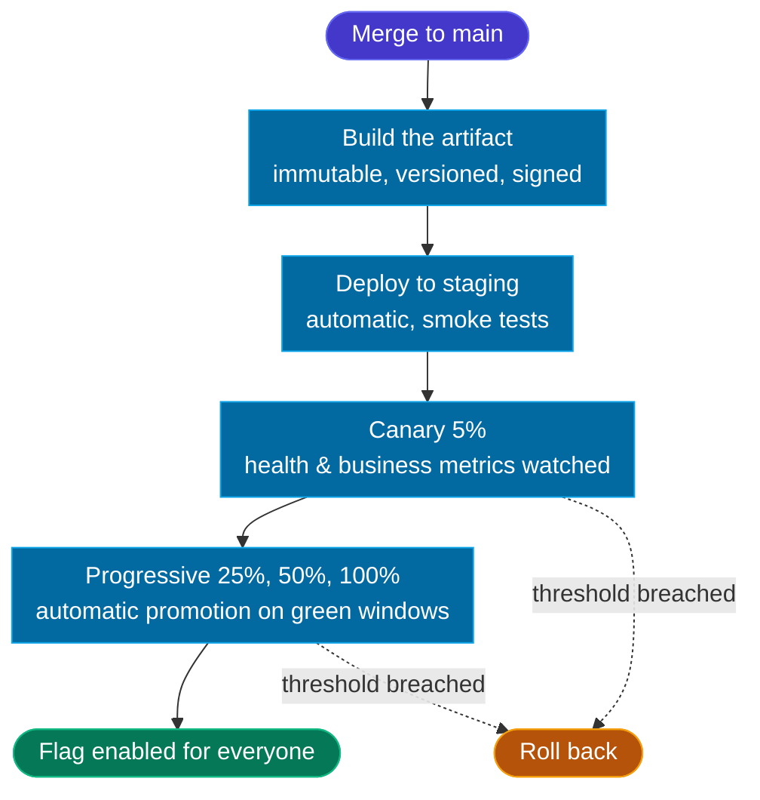

# 🚀 6 — Release

  STAGE 6
  Automated deployment, reversible at any step

Release delivers a change that has passed Prove stage safely. The change is deployed to production or QA automatically depending on the team workflow.
In production it should reaches users gradually, and every step can be undone quickly if something goes wrong.

Deploying and releasing are two different things. Deploying puts the new code in production, switched off. Releasing is
switching it on for users, for a few at first, then for everyone.

## Purpose

| Input | Output | Owner |
|---|---|---|
| A change that passed [5 — Prove](./stage-prove) | Value in production, observable and reversible | QA, maintainer |

## Model

- Trunk-based: tag to `main` is the release trigger.
- Every release produces an immutable, versioned artifact.
- Deploy is automatic to `staging`, then progressive to `production`.
- The `enable` feature flag lets you deploy code before releasing it to users.
- Every release uses the outcome metric already committed in the [1 — Triage](./stage-triage) backlog issue. [7 — Learn](./stage-learn) takes over and checks it once the rollout completes.

The `enable` feature flag is the actual release decision. Everything before it is deployment. The rollback paths are in the [Rollback](#rollback) section below.

## Rollout rules

The deployment pipeline applies a few fixed rules at each step. They are standard features of progressive delivery
tooling, and no AI is involved in these decisions.

| Rule | What it checks | Effect |
|---|---|---|
| **Promotion** | Health and business metrics stay inside their thresholds for the whole watch window | The rollout advances to the next step automatically |
| **Health check** | Smoke tests in staging, then error rate, latency, and saturation at each step in production | A failing check halts the rollout |
| **Rollback threshold** | A limit declared per change before deployment | Crossing it triggers rollback automatically |

Looking ahead for problems after the release belongs to [7 — Learn](./stage-learn).

## Rollback

| Mechanism | Time to effect | Used for |
|---|---|---|
| Feature flag off | Seconds | Behaviour regressions |
| Traffic shift back to previous version | < 1 minute | Deployment-level failures |
| Redeploy previous artifact | Minutes | Config or runtime issues |
| Forward fix | Hours | Data-affecting issues where rollback is unsafe |

Every change with a **High** or **Critical** blast radius has its rollback mechanism named in the
[Think record](./stage-think#the-think-record) and validated in [5 — Prove](./stage-prove) before it is deployed. A change with no rollback path is not deployed.

## Where AI is used

AI has no role in Release: it drafted the release notes and the changelog from merged pull requests durong the code stage, and a developer
approved it. The rollout itself runs on standard deployment tooling, with no AI involved.

## Exit gate

A release is complete when the rollout has reached 100 %, the watch window has passed without
threshold breach, and the observability dashboard for the change is live in [Learn](./stage-learn).
