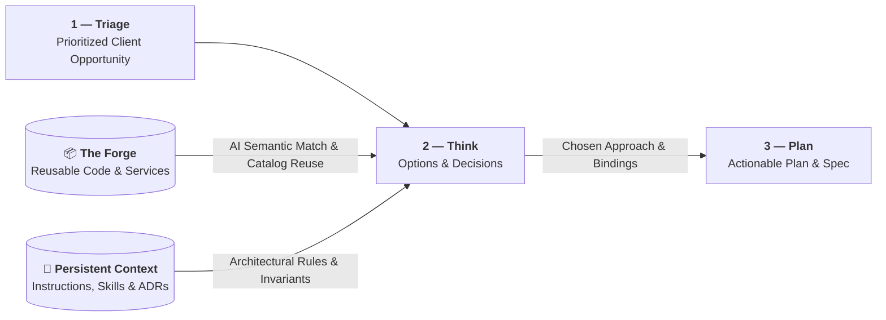

# 💡 2 — Think

  STAGE 2
  Options exploration, trade-offs &amp; architectural decisions

Where a prioritized client need is turned into a decided approach before anything is planned or built.
Rather than designing from scratch, **Think combines two enterprise pillars**: **[The Forge](./forge)**
(an organizational catalog of reusable functions, libraries, and services) and the
**[Persistent Context](./persistent-context)** (committed repository instructions, specialized agent skills,
existing specs, and ADR invariants). Think explores the options, weighs the trade-offs, and records the
decisions that [3 — Plan](./stage-plan) then breaks down into work.

## Purpose

| Input | Output | Owner |
|---|---|---|
| A ranked backlog issue from [1 — Triage](./stage-triage) + **[The Forge](./forge)** (reusable functions, libraries, services) + **[Persistent Context](./persistent-context)** (instructions, prompts, skills, agents, existing specs, and ADRs, the architecture decision records that capture past decisions) | A Think record: the options considered, the chosen approach, **Forge asset bindings**, Persistent Context constraints, blast radius, and any new ADR | Product lead + architect |

## The Think record

Every work item carries a short, reviewable record of the decision made before planning starts.

| Field | Content | Length |
|---|---|---|
| **Options considered** | The credible approaches, including reuse from The Forge versus custom build | 2–4 options |
| **Chosen approach** | The selected option and the reasoning behind it | 1 paragraph |
| **Forge asset bindings** | Pre-approved reusable services, libraries, and API contracts composed into the approach | List of Forge references |
| **Constraints & invariants** | ADRs, security, compliance, latency, and schema compatibility rules that bound the solution | Bullets |
| **Blast radius** | Affected APIs, schemas, queues, and consumers. Classified here, once, and inherited by the Plan record | Bullets |

The [Plan record](./stage-plan#the-plan-record) inherits the Forge bindings, constraints, and blast radius from this record. They are decided here and not re-decided in Plan.

## Enterprise foundations: The Forge & Persistent Context

Writing bespoke software or deciding in an informational void are primary anti-patterns in an industrialized factory.
In the Think phase, squads ground every decision in two complementary enterprise assets:

### 1. The Forge (What we reuse)
The [Forge](./forge) provides reusable code (functions, libraries, services), in-context templates, and certified interface contracts. Think searches it first, so the chosen approach composes existing assets before anything is built.

### 2. Persistent Context (How we decide)
Provisioned and kept synchronized across repositories via persistent context and agent catalogs (e.g., **`coding-pal`**), the [Persistent Context](./persistent-context) ensures decisions obey repository reality:
1. **Architecture Decision Records (ADRs)**: Invariants that constrain technology choices, state management, and communication patterns.
2. **Existing System Specifications**: Ground-truth documentation of current behavior to prevent regressions.
3. **Specialized Agent Skills & Catalogs**: Curated agent personas and structured workflows that guide the LLM to identify performance bottlenecks and security boundaries.

### How they work together in Think
- **Semantic Discovery & Binding**: The LLM searches The Forge for reusable assets and checks Persistent Context for architectural invariants.
- **Composition over Custom Code**: Architects mandate composing existing Forge services rather than generating bespoke logic.
- **Decision Locking**: The chosen approach, interface schemas from The Forge, and constraints from Persistent Context are locked in the Think record before entering [3 — Plan](./stage-plan).

## Where AI is used

AI explores the option space and checks it against the organization's reality; the architect and
product lead make the call.

| Task | AI role | Human role (Product lead / Architect) |
|---|---|---|
| **Option exploration** | Draft credible approaches with trade-offs, cost, and risk for each | Select the approach and challenge the assumptions |
| **Forge discovery & composition** | Semantically query The Forge catalog, match reusable code modules and shared services to the need | Confirm asset suitability, avoid duplicate development, approve integration bindings |
| **Codebase & context scan** | Scan the codebase, Forge assets, and Persistent Context for relevant constraints | Validate the architectural approach and component boundaries |
| **Impact & contract analysis** | Detect affected APIs, database schemas, message queues, and consumer dependencies | Confirm blast radius and trigger an ADR if boundaries shift |

## Architectural decisions (ADRs)

If the chosen approach requires altering a public API, changing a database schema, or shifting service
boundaries, AI drafts an Architecture Decision Record (ADR) based on repository conventions. The
architect reviews and signs the ADR, which is committed into the repository
to immediately enrich the [Persistent Context](./persistent-context).

## Exit gate

A work item leaves Think and enters [3 — Plan](./stage-plan) only when:

1. the credible options, including Forge reuse, have been evaluated and one approach is chosen,
2. reusable code modules and shared services from **The Forge** are bound to the approach where applicable,
3. architectural constraints, domain specs, and invariants from the **Persistent Context** are validated,
4. blast radius is classified ([Decision Rights](./decision-rights#blast-radius-and-required-human-validation)),
5. all architectural changes are recorded in an ADR committed to the Persistent Context.

A reusable prompt in Persistent Context, for example "compare these options against our ADRs and Forge catalog", keeps option write-ups consistent.

**Previous:** [1 — Triage](./stage-triage) · **Next:** [3 — Plan](./stage-plan)
