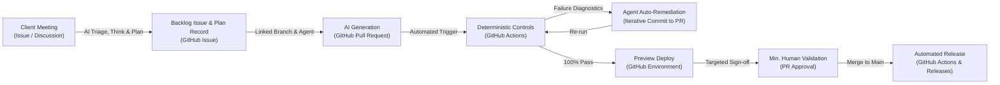

# Tooling: The Unified Substrate

In Agentic Software Factory, tooling is not an arbitrary collection of disconnected SaaS products. Tool sprawl is
the primary cause of **AI context fragmentation**: when business requirements live in Jira, meeting
notes in Confluence, discussions in Slack, code in Git, pipelines in Jenkins, and releases in an external
portal, the AI agent's context is broken across authentication silos, sync lags, and incompatible APIs.

> **To maximize AI capability, minimize tooling sprawl.** Consolidate the entire lifecycle into a
> **single unified substrate** — exemplified by the **GitHub ecosystem** — where business needs,
> code, deterministic verification, and release share one unbroken context graph.

## Why a single substrate matters for AI

1. **Zero context loss from meeting to release**: An AI agent can read the original client meeting
   notes in an Issue, trace the Plan acceptance criteria, inspect the repository Persistent Context, generate the code
   in a Pull Request, read CI failure logs from Actions, and publish the Release without leaving the platform.
2. **Native bidirectional links**: Every PR is natively linked to its Issue, branch, commit, check run,
   preview environment, and release tag. No third-party integrations or fragile webhook syncs required.
3. **Unified permission and security boundary**: The model, agent runner, and CI pipeline operate under
   one consistent role-based access control (RBAC) and audit log.
4. **Token and latency optimization**: AI agents fetch rich, structured context via native platform APIs
   in milliseconds instead of navigating dozens of external tool APIs.

## The unified GitHub operating stack

Agentic Software Factory implements this unified model by utilizing the GitHub platform end-to-end:

| Lifecycle Stage | Capability | GitHub Native Implementation | Why it preserves AI context |
|---|---|---|---|
| **1 — Triage, 2 — Think & 3 — Plan** | Meeting notes, backlog & issue tracking | **GitHub Issues** + **GitHub Projects** | Transcripts, problem statements, and Plan records live directly where code lives |
| **Persistent Context** | Instructions, prompts, skills, agents, specs, ADRs | **Repository Markdown (`.github/`, `docs/`)** | Persistent Context and curated agent catalogs (e.g., via `coding-pal`) loaded directly into agent prompts |
| **The Forge (Asset Reuse)** | Reusable code & in-context templates | **Enterprise package registries & templates** | Pre-built modules and in-context templates (e.g., `Gatelin`, `foxnox`) injected into agent prompts to avoid bespoke coding |
| **4 — Code** | Autonomous code & test generation | **GitHub Copilot / Coding Agents / CLI** | Agents operate natively against repository files, branches, and issue context |
| **5 — Prove: Deterministic Controls** | Clean re-run of automated checks, contract, mutation & security tests | **GitHub Actions** | Deterministic gates run in CI; error logs stream directly back to remediating agents |
| **5 — Prove: Preview Environments** | Ephemeral preview deployments | **GitHub Environments & Deployments** | Live preview links post directly to the PR for Minimum Human Validation |
| **5 — Prove: Security & Compliance** | Secret scanning, SAST, dependency review | **GitHub Advanced Security (CodeQL, Dependabot, Push Protection)** | Automatic blocking of vulnerabilities before code can ever merge |
| **5 — Prove: Human Validation** | Minimum Human Validation sign-off | **GitHub Pull Requests & Reviewers** | Risk-weighted approvals tied to blast radius and preview verification |
| **6 — Release** | Automated deployment & immutable artifacts | **GitHub Actions + GitHub Releases / Packages** | Versioned tags, signed packages, and automated changelogs generated from Plan |
| **7 — Learn** | Issue retrospectives & the hypothesis ledger | **GitHub Issues & Discussions** | Incidents and hypothesis ledger entries link directly to the PRs and releases that caused them |
| **7 — Learn: Monitoring** | Telemetry analysis & predictive monitoring | **An observability platform** (the one capability GitHub does not cover natively) | Alerts open GitHub Issues automatically, linked to the release that caused them, so monitoring output stays in the same context graph |

## The unbroken context chain

In a unified GitHub stack, the AI agent traverses a single unbroken chain:

## Model selection & gateway

While the workspace and delivery substrate is unified on GitHub, model routing remains flexible:

| Workload | Recommended Tier | Objective |
|---|---|---|
| Meeting transcription & initial extraction | Speech-to-text + Fast summarizer | High volume, low latency |
| Plan structuring & ambiguity detection | Reasoning / Frontier | Precise boundary definitions and boolean acceptance criteria |
| Autonomous code & test generation | High-capability Coding Agent | Strict adherence to Persistent Context instructions |
| Fast fix loops (build, type & lint errors) | Fast coding model | Rapid iterative fixing of compiler and linter diagnostics |
| Architecture reasoning & cross-service ADRs | Frontier reasoning model | Broad context window and systemic invariant verification |

## Eliminating tool sprawl

Every external tool introduced into the software factory imposes a **context penalty**:
- If a tool does not natively integrate into the agent's context graph, it creates an information black hole.
- Any proposal to adopt an external SaaS tool outside the core substrate requires an ADR proving that the capability cannot be met natively and detailing how AI context will be preserved without loss.
