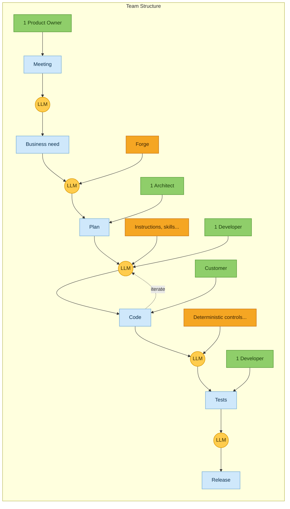

## Development process: Meeting-Driven Development

Flow Stack replaces status meetings with short, role-specific checkpoints around an AI-driven
loop. Each task moves through an LLM step; humans inject **persistent context** — not opinions
repeated live — and step in only where a decision or judgment call is required.

| Legend | Meaning |
|---|---|
| 🟩 People | The single accountable human at each checkpoint — never a group meeting |
| 🟨 AI | The LLM step that turns the previous artifact into the next one |
| 🟦 Task | The artifact produced: business need, plan, code, tests, release |
| 🟧 Persistent context | Committed knowledge (Forge, instructions, skills, deterministic controls) fed to the LLM |

This is the [Build loop](./guide/layer-build) and [Proof](./guide/layer-proof) gate of Flow Stack in
practice: a kickoff replaces the status meeting, the [Context Layer](./guide/context-layer) replaces
repeated verbal instructions, and [deterministic controls](./guide/guardrails) replace "trust me, it
works" before release.
