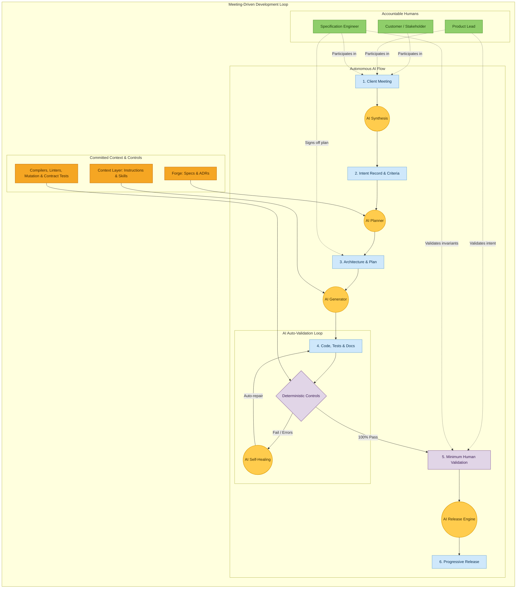

## Development process: Meeting-Driven Development

Flow Stack operates on **Meeting-Driven Development**: the development lifecycle begins in the client
meeting and flows autonomously through AI generation to production release.

Developers **do not write code syntax anymore**. Instead, engineers design specifications, curate
the [Context Layer](./guide/context-layer), and build dense [deterministic controls](./guide/guardrails).
AI agents autonomously generate code and tests, auto-validating against deterministic testbeds in
closed self-healing loops before requesting **minimum human validation** for high-level business intent.

| Component | Nature | Role in the operating model |
|---|---|---|
| 🎙️ Client Meeting | Collaboration | The primary trigger for software evolution; transcribed and extracted by AI in real time |
| 🟨 AI Agents | Autonomous | Synthesizes intent, designs plans, generates 100% of code, tests, and release notes |
| 🟧 Context & Controls | Committed Assets | Instructions, skills, specs, compilers, AST linters, mutation tests, and contract suites |
| 🟪 AI Auto-Validation | Closed-Loop | Autonomous execution of deterministic controls with self-healing iterations until all pass |
| 🟩 Minimum Human Validation | Targeted Sign-Off | High-level confirmation of business intent and safety invariants — never manual syntax review |

This operational flow turns the [Build](./guide/layer-build) and [Proof](./guide/layer-proof) layers
into an autonomous engine: client dialogue replaces stale tickets, the [Context Layer](./guide/context-layer)
replaces verbal guidance, and [deterministic controls](./guide/guardrails) replace subjective human code reviews.
