## Development process: Meeting-Driven Development

Agentic Software Factory operates on **Meeting-Driven Development**: the development lifecycle begins in the client
meeting and flows autonomously through AI generation to production release.

AI agents autonomously generate 100% of code and tests. Engineers design specifications, curate
the [Context Layer](./guide/context-layer), and build dense [deterministic controls](./guide/guardrails).
AI agents auto-validate against deterministic testbeds in
closed self-healing loops before requesting **minimum human validation** for high-level business intent.

```mermaid
---
caption: Meeting-Driven Development — the 6-layer operational lifecycle from client meeting to production release
---
flowchart TD
    subgraph L1 ["L1 — Need: Client Need & Demand"]
        direction LR
        S_IN["<b>🎙️ Client Meeting</b><br/>Customer & Product Lead"]
        --> S_AI["<b>🤖 Real-Time AI Extraction</b><br/>Transcribe dialogue & extract client need"]
        --> S_OUT["<b>📋 Ranked Opportunity</b><br/>Verbatim quotes & blast-radius estimate"]
    end

    subgraph L2 ["L2 — Spec: Executable Specifications"]
        direction LR
        I_AI["<b>🤖 AI Spec Drafting</b><br/>Parse Context Layer & discover boundaries"]
        --> I_OUT["<b>📋 Executable Spec Record</b><br/>Problem, outcome metric & acceptance criteria"]
        --> I_SIGN["<b>✍️ Spec Engineer Sign-Off</b><br/>Validate approach & sign off criteria"]
    end

    subgraph L3 ["L3 — Build: Autonomous AI Generation"]
        direction LR
        B_PLAN["<b>🤖 AI Agent Planning</b><br/>File scope & test strategy"]
        --> B_GEN["<b>🤖 Autonomous Code Generation</b><br/>100% code, tests & documentation"]
        --> B_LOCAL["<b>🛡️ Local Deterministic Controls</b><br/>Compilers, linters & unit tests"]
        B_LOCAL -->|❌ Fail| B_HEAL["<b>🔄 AI Self-Healing</b><br/>Auto-repair error traces"]
        B_HEAL --> B_GEN
        B_LOCAL -->|✅ Pass| B_PR["<b>📦 Verified Pull Request</b><br/>100% green local proof"]
    end

    subgraph L4 ["L4 — Proof: Deterministic Auto-Validation"]
        direction LR
        P_CI["<b>🛡️ Dense Deterministic Harness</b><br/>AST rules, contracts, mutation & SAST"]
        -->|✅ 100% Pass| P_MHV["<b>🎯 Minimum Human Validation</b><br/>Verify business intent & invariants"]
        --> P_MERGE["<b>✅ Merge to Main</b><br/>Release trigger"]
        P_CI -->|❌ Fail| P_HEAL["<b>🔄 Autonomous AI Self-Repair</b><br/>Auto-repair code in CI"]
        P_HEAL --> P_CI
    end

    subgraph L5 ["L5 — Release: Progressive Rollout"]
        direction LR
        R_CANARY["<b>🚀 Canary Rollout</b><br/>Automated health verification"]
        --> R_FLAG["<b>🚩 Feature Flag</b><br/>Decoupled activation"]
    end

    subgraph L6 ["L6 — Learn: Outcome Feedback"]
        direction LR
        M_TELE["<b>📈 Production Telemetry</b><br/>Observe outcome metric in reality"]
        --> M_LEDGER["<b>⚖️ Hypothesis Ledger</b><br/>Validated, inconclusive, or deleted"]
        --> M_LOOP["<b>🔄 Feedback to L1 & Context</b><br/>Refines specs and Context Layer"]
    end

    S_OUT ==> I_AI
    I_SIGN ==> B_PLAN
    B_PR ==> P_CI
    P_MERGE ==> R_CANARY
    R_FLAG ==> M_TELE
    M_LOOP -. Feeds back into Need .-> S_IN
```

| Layer | Focus | Input $\rightarrow$ Output | Owner & Role of AI |
|---|---|---|---|
| **[L1 Need](./guide/layer-need)** | Client Need & Demand | Client meeting $\rightarrow$ Ranked Opportunity | **Product Lead**: AI transcribes meeting and extracts verbatim customer pain in real time |
| **[L2 Spec](./guide/layer-spec)** | Executable Specifications | Opportunity $\rightarrow$ Executable Spec Record | **Spec Engineer + Product Lead**: AI drafts formal acceptance criteria, boundaries, and ADRs |
| **[L3 Build](./guide/layer-build)** | Autonomous AI Generation | Spec Record + Context Layer $\rightarrow$ Verified PR | **Supervised AI Build Agent**: AI generates 100% of code/tests with local self-healing |
| **[L4 Proof](./guide/layer-proof)** | Deterministic Auto-Validation | Pull Request $\rightarrow$ Mathematical Proof & Merge | **Squad + Platform Rails**: CI auto-validates 7 deterministic gates; humans validate intent |
| **[L5 Release](./guide/layer-release)** | Progressive Rollout | Merged `main` $\rightarrow$ Production Value | **Squad on Platform Rails**: Automated staging, canary rollout, and feature flag activation |
| **[L6 Learn](./guide/layer-learn)** | Outcome Feedback | Production Behavior $\rightarrow$ Hypothesis Verdict | **Squad + Enablement**: Measures outcome metrics; feeds new needs to L1 and Context Layer |

This operational flow turns the [Build](./guide/layer-build) and [Proof](./guide/layer-proof) layers
into an autonomous engine: client dialogue replaces stale tickets, the [Context Layer](./guide/context-layer)
replaces verbal guidance, and [deterministic controls](./guide/guardrails) replace subjective human code reviews.
